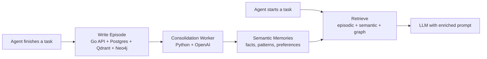

# REM — Recursive Episodic Memory for AI Agents

[](LICENSE)
[]()
[]()

**The memory operating system for AI agents.  
Persistent episodic storage, automatic consolidation, instant retrieval.**

---

## Why REM?

LLM agents today mostly live in the moment. They rely on:

- a **short-lived context window** that resets every session,
- naive RAG that **retrieves text chunks** but doesn’t really understand them,
- brittle ad‑hoc hacks to remember user preferences or long-running projects.

REM is built to fix that. It gives your agents:

- **Episodic memory** — every interaction becomes a structured episode.
- **Recursive consolidation** — patterns across episodes become semantic memories.
- **Graph reasoning** — a causal graph of episodes and facts your agent can traverse.

### Comparison

| Feature                  | **REM** |
|------------------------- |---------|
| Persistent episodes      | ✅      |
| Recursive consolidation  | **✅**  |
| Causal episode graph     | **✅**  |
| Forgetting policy        | **First‑class** |
| Self‑evolving memories   | **✅**  |

REM is designed as **infrastructure**, not a toy demo. It is the memory layer you wire into every agent you run in production.

---

## How It Works

REM runs a simple but powerful loop: **Write → Consolidate → Retrieve**.



High level:

1. **Write**  
   After each task, your agent sends a short description of what happened.  
   REM stores:
   - raw content,
   - intent, entities, domain, emotion,
   - outcome and importance score.

2. **Consolidate**  
   A background worker clusters similar episodes and asks an LLM to extract:
   - durable **facts**,
   - user **preferences**,
   - recurring **patterns**,
   - important **skills** and **rules**.

   These become **semantic memories** with confidence and evidence counts.

3. **Retrieve**  
   Before each new task, REM:
   - embeds the query,
   - retrieves nearest episodes and semantic memories,
   - expands via the temporal graph,
   - builds a clean **injection prompt** you pass to your LLM.

---

## Quick Start

### 1. Install the Python SDK

```bash
pip install rem-memory
```

### 2. Write and retrieve in 10 lines

```python
from rem_memory import REMClient

client = REMClient(
    api_key="rem_sk_...",          # from REM dashboard or API
    base_url="http://localhost:8000",
)

# After each task
await client.write(
    content="User prefers TypeScript over JavaScript",
    agent_id="agent_123",
    user_id="user_456",
    outcome="success",
)

# Before each task
result = await client.retrieve(
    query="What does this user prefer for frontend work?",
    agent_id="agent_123",
)

print(result.injection_prompt)   # Ready to drop into your LLM call
```

---

## Architecture

```text
                               ┌─────────────────────────┐
                               │       Dashboard        │
                               │   Next.js 14 + D3.js   │
                               └──────────┬─────────────┘
                                          │ HTTP
                                          │
┌─────────────────────────┐      ┌────────▼───────────┐
│     Python Worker       │◀────▶│       Go API       │
│ FastAPI + Celery + LLMs │ HTTP │  Fiber v2 + pgx    │
└──────────┬──────────────┘      └────────┬───────────┘
           │                               │
           │                               │
   ┌───────▼───────┐       ┌───────────────▼──────────────┐
   │  OpenAI / LLM │       │          Databases            │
   └───────────────┘       │  Postgres 16  (episodes,      │
                            │   users, agents, semantics)   │
                            │  Qdrant 1.7  (vector store)   │
                            │  Neo4j 5     (episode graph)  │
                            │  Redis 7     (cache, queues)  │
                            └───────────────────────────────┘
```

**Tech stack**

| Layer         | Tech                                          |
|---------------|-----------------------------------------------|
| Go API        | Go 1.22, Fiber v2, pgx, zap                   |
| Python Worker | Python 3.11, FastAPI, Celery, OpenAI          |
| Databases     | PostgreSQL 16, Qdrant 1.7, Neo4j 5, Redis 7   |
| Dashboard     | Next.js 14, React 18, Tailwind, D3, Recharts  |
| SDK           | Python, httpx, Pydantic, LangChain adapter    |

---

## Self‑Hosting

```bash
git clone https://github.com/yourusername/rem
cd rem

# Start Go API, Python worker, and dashboard (requires local Postgres, Redis, Neo4j, Qdrant)
make dev
```

Then:

- Go API: `http://localhost:8000`
- Python Worker: `http://localhost:8001`
- Dashboard: `http://localhost:3000`

See `docs/quickstart.md` for a 5‑minute end‑to‑end setup.

---

## API & SDK

- **API reference**: `docs/api-reference.md` (to be expanded).  
- **Python SDK**:
  - Package: `rem-memory`
  - Types: `WriteResult`, `RetrieveResult`, `SemanticMemory`, `Agent`
  - Errors: `REMError`, `AuthenticationError`, `NotFoundError`, `RateLimitError`, `APIError`, `ConnectionError`

**LangChain integration**

```python
from rem_memory import REMClient
from rem_memory.integrations.langchain import REMMemory
from langchain.chains import ConversationChain
from langchain_openai import ChatOpenAI

client = REMClient(api_key="rem_sk_...", base_url="http://localhost:8000")

memory = REMMemory(
    rem_client=client,
    agent_id="agent_123",
    user_id="user_456",
)

llm = ChatOpenAI(model="gpt-4o-mini")
chain = ConversationChain(llm=llm, memory=memory)
```

Every call:

- **before**: REM retrieves relevant memories → injected as `relevant_memories`.
- **after**: REM writes a new episode based on input/output.

---

## Dashboard

The dashboard (`/dashboard`) lets you:

- Inspect **memory health** and key metrics.
- Watch a **live feed** of episodes streaming in from your agents.
- Explore a **force‑directed memory graph** (episodes + semantic memories).
- Browse **semantic memories** as “learned fact” cards.
- Use a **live retrieval playground** to see exactly what prompt context REM builds.

---

## Research

REM is inspired by work on:

- episodic vs semantic memory in cognitive science,
- systems like Zep, Mem0, and modern RAG,
- agentic architectures that maintain state over long time horizons.

We are working on an arXiv paper detailing the consolidation engine and graph structure.

---

## Roadmap

- [ ] TypeScript SDK and LangChain.js integration  
- [ ] Managed cloud offering  
- [ ] Fine‑grained forgetting and redaction policies  
- [ ] Multi‑tenant dashboard and team features  

---

## Contributing

Contributions are very welcome:

1. Fork the repo.
2. Create a feature branch.
3. Run `make test` and `make lint`.
4. Open a PR with a clear description and screenshots where helpful.

We’re especially interested in:

- integrations (LangChain, LlamaIndex, Autogen, custom frameworks),
- new consolidation strategies,
- better graph visualizations and UX.

---

## License

MIT — see `LICENSE` for details.

